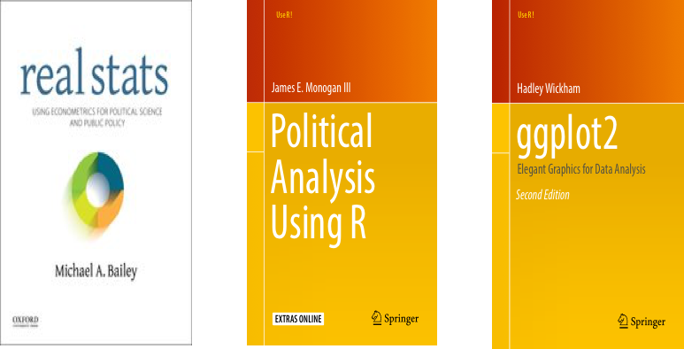

## Your Professor

 - Andrew O'Geen (as in "gym" and "generous")
 
 - @Davidson: 7 years, American politics, law & courts, methods and statistics
 
 - Hometown (long, long ago): Simsbury, CT
 
 - School: University of Kentucky, Georgia State University, SUNY-Stonybrook

## Your Professor

How to find me:

1. Look around
2. Email me: anogeen@davidson.edu
3. Call me: 704.894.2476
4. Make an appointment: [andrewogeen.com/officehours](http://andrewogeen.com/officehours)

## Your Texts

## Your Software

