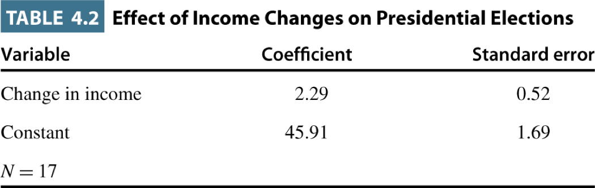
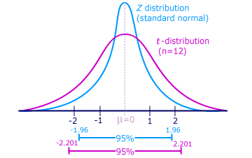

## The Logic
**Suppose**

## The Logic
**Suppose**  
The true relationship between two variables is zero\ldots$\beta_1=0$

## The Logic
**Suppose**  
The true relationship between two variables is zero\ldots$\beta_1=0$
  
**But, in our study**

## The Logic
**Suppose**  
The true relationship between two variables is zero\ldots$\beta_1=0$
  
**But, in our study**  
We get an estimate for $\hat{\beta_1}$ that is not zero

## The Logic
**Suppose**  
The true relationship between two variables is zero\ldots$\beta_1=0$
  
**But, in our study**  
We get an estimate for $\hat{\beta_1}$ that is not zero
  
**Whatever shall we do?**

## The Logic

If the true relationship between our variables is zero, how likely would we be to see the result we did?

## The Logic

If the true relationship between our variables is zero, how likely would we be to see the result we did?
  
or, more formally

## The Logic

If the true relationship between our variables is zero, how likely would we be to see the result we did?
  
or, more formally
  
What is the probability of seeing _our_ estimate of $\hat{\beta_1}$ if the true value of $\beta_1$ is zero?

## Testing Hypotheses

When we test hypotheses, we _always_ evaluate a **null** hypothesis: $\beta_1=0$
  
against an **alternative** hypothesis:  $\beta_1\neq0$ or $\beta_1>0$ or $\beta_1<0$

## Terminology

**Statistical Significance**: coefficient is sufficiently different from zero to reject the null hypothesis
  
**Type I error**:  Rejecting the null hypothesis when $\beta_1=0$  
(aka Concluding there is a relationship when none exists)  
  
**Type II error**: Failing to reject the null when $\beta_1\neq0$  
(aka Concluding there is no relationship when one exists)

## Terminology {.c}

We **never** prove or disprove.  We only _reject_ or _fail to reject_ the null hypothesis. 

## An Example

```{r fig.width=5, fig.height=0.5,echo=FALSE}
library(png)
library(grid)
img1 <- readPNG("images/modelResults.png")
 grid.raster(img1)
```

```{r fig.width=5, fig.height=5,echo=FALSE}
library(png)
library(grid)
img2 <- readPNG("images/nullNormal.png")
 grid.raster(img2)
```

## Evaluating Hypotheses 

- To decide whether we can reject the null or not, we need a threshold.

- This is the **significance level**

- The probability of committing a Type I error

- Denoted as $\alpha$

- We get to choose, but 0.05 is typical

## Evaluating Hypotheses

- Usually done with a $t$ test

- Quick rule of thumb: if coefficient is twice the standard error we can reject the null.



## The $t$ Test

- The primary vehicle for testing hypotheses in OLS

- Test statistic is just the cofficent ($\hat{\beta_1}$) divided by the standard error

- How many standard errors away from zero is our estimate of $\hat{\beta}$?

- How far out in the tails of the hypothetical sampling distrubtion are we?

## The $t$ distribution

- Developed by scientists at the Guiness Brewery in Ireland

- Looks exactly like the normal distribution in large samples

- Has "fatter" tails as sample size (degrees of freedom) decreases

## The $t$ distribution



## The $t$ distribution

- Developed by scientists at the Guiness Brewery in Ireland

- Looks exactly like the normal distribution in large samples

- Has "fatter" tails as sample size (degrees of freedom) decreases

- Helps us account for larger standard errors in smaller samples

## Critical Values

- The critical value is just the threshold for the test statistic

- So, when we evaluate our hypothesis we do so relative to the critical value

- Depends on the nature of our hypothesis, $\alpha$ level, and the shape of $t$ distribution

- See Table 4.4 on p 104 of Bailey for list.

## Significance

- We need to be careful about our conclusions

- Substantive signficance $\neq$ Statistical significance

- What are we potentially ignoring?

- Are we assigning too much importance to a result?

## Confidence Intervals

- Give us a range within which we're confident the true parameter lies.

- What range of true values would be most likely to produce the estimate from our model?

- We define the size of the interval with $\alpha$ and $t_{crit}$

- 95% confidence is standard, though by no means universal

## Confidence Intervals

$\hat{\beta_1} \pm t_{crit} \times se(\hat{\beta_1})$

- Suppose $\hat{\beta_1} = 0.41$ and $se(\hat{\beta_1}) = 0.1$

- At $\alpha = 0.05$, $t_{crit}=1.96$

- So, confidence interval is...

- $0.41 \pm 1.96\times0.1 = 0.214 \text{ to }  0.606$

## Confidence Intervals

- Give us a range within which we're confident the true parameter lies.

- What range of true values would be most likely to produce the estimate from our model?

- We define the size of the interval with $\alpha$ and $t_{crit}$

- 95% confidence is standard, though by no means universal

- Is 0 in our confidence interval???

## The End {.c}
\centering
What questions do you have?


