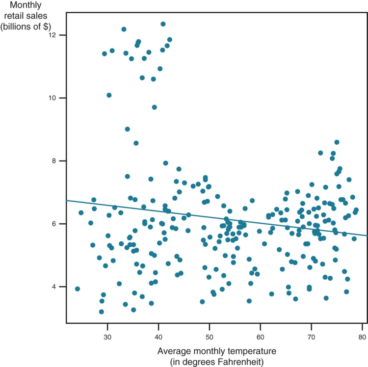
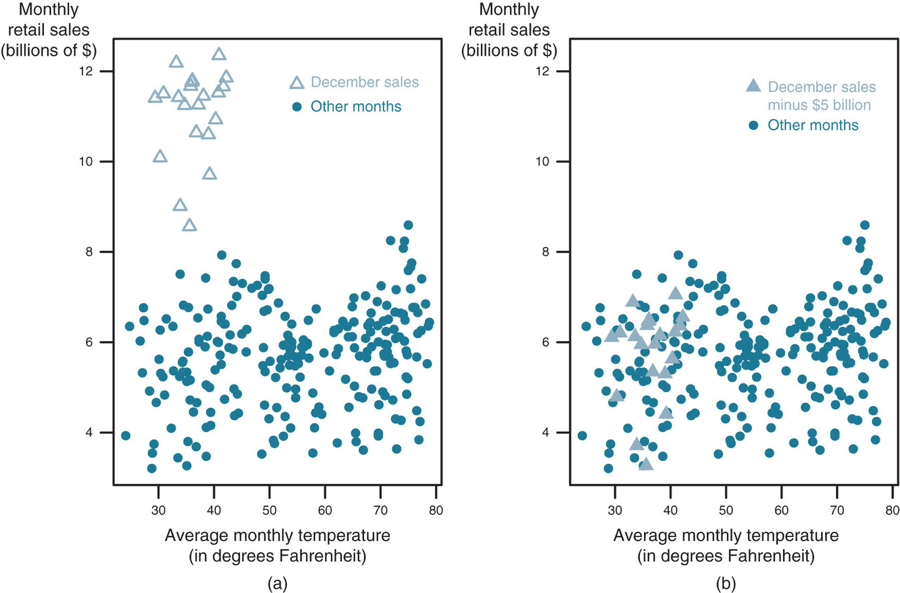
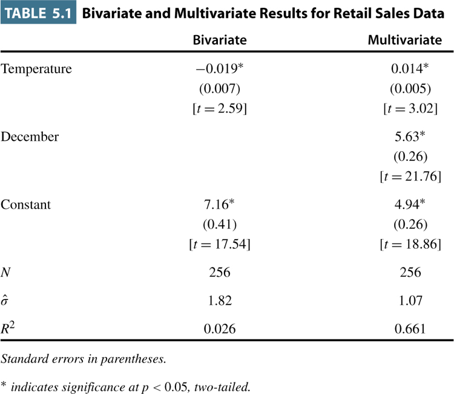
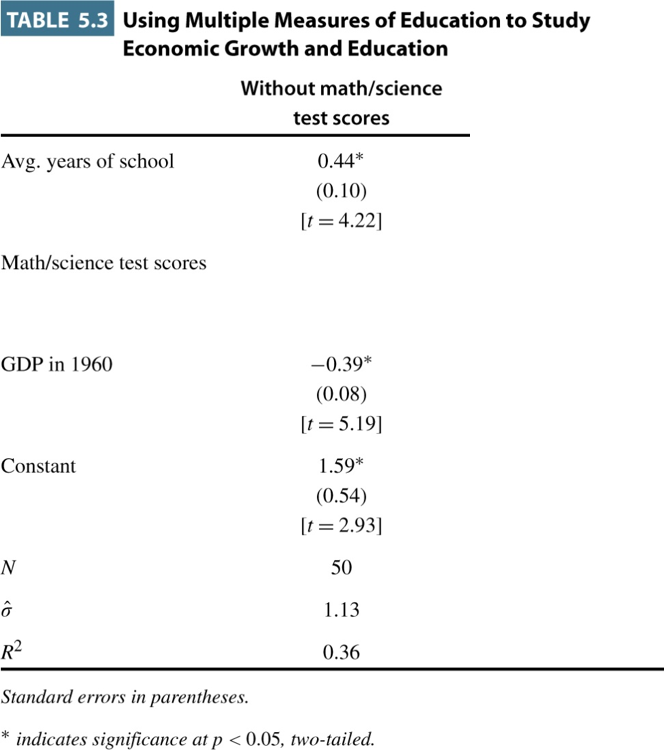
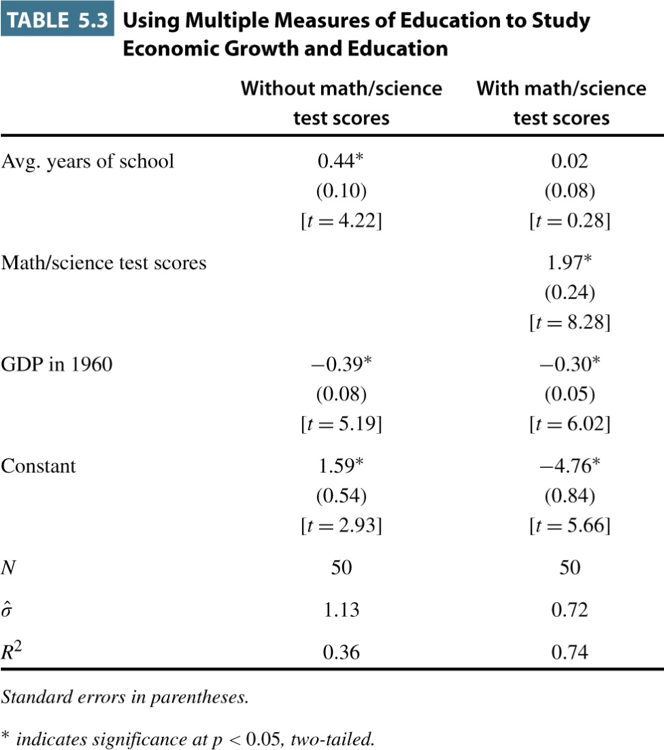

## Fighting Endogeneity

- Definition: correlation between X and error term.

- Where is the effect coming from??

- Error term is all the unmeasured stuff

- Fight endogeneity by including relevant variables in our model

## Fighting Endogeneity

- $Y_i = \beta_0 + \beta_{1}X_{1i} + \beta_{2}X_{2i}\ldots + \beta_{k}X_{ki} + \epsilon_i$

- When we add additional variables, we "pull" them from the error term

- Reduces bias and increases precision.

## An Example

- In our education research we find a connection between hours studied and success on a Spanish exam

- $Score_i = \beta_0 + \beta_{1}Hours Studied_i + \epsilon_i$

- What's in the error term?

## An Example

- In our education research we find a connection between hours studied and success on a Spanish exam

- $Score_i = \beta_0 + \beta_{1}Hours Studied_i + \epsilon_i$

- What's in the error term?

- A better model: 

- $\small Score_i = \beta_0 + \beta_{1}HoursStudied_i + \beta_{2}SpanishAtHome_i + \epsilon_i$

## A Simplified Example (with pictures)



## A Simplified Example (with pictures)



## A Simplified Example (without pictures)



## Omitted Variable Bias - Consequences

- What happens when we omit an important variable?

- Our estimates of the effects of variables in the model will be biased

- Amount of bias depends on relationship between variables

## Omitted Variable Bias in Action



## Omitted Variable Bias in Action



## An Example in R

```{r echo=FALSE}
anes <- read.csv("data/ReviewII.csv", header=T, sep=",")
library(faraway)
```

```{r eval=TRUE, comment=NA}
library(faraway)
m1 <- lm(income ~ age + female, data = anes)
sumary(m1)
```

## An Example in R

```{r eval=TRUE, comment=NA}
m2 <- lm(income ~ age + educ1_7 + female, data = anes)
sumary(m2)
```


## The End {.c}
\centering
What questions do you have?


