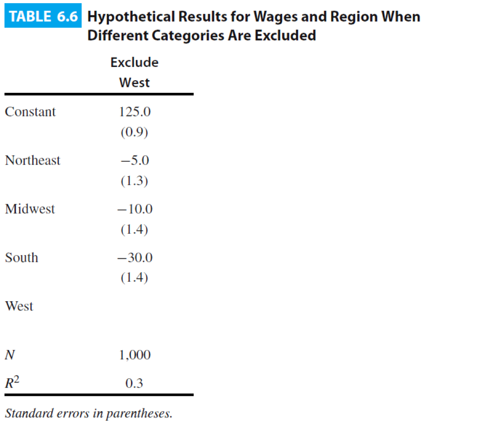
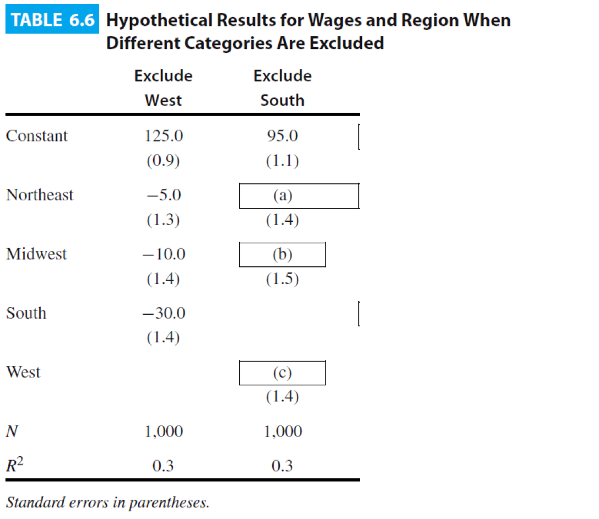
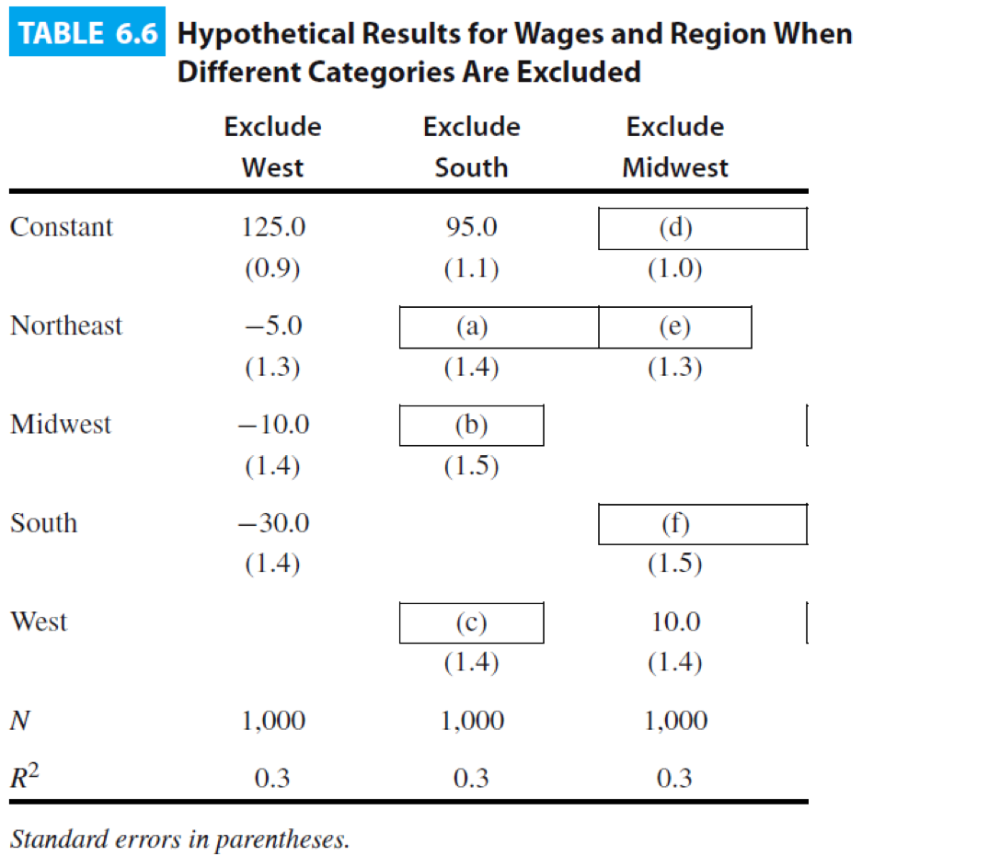
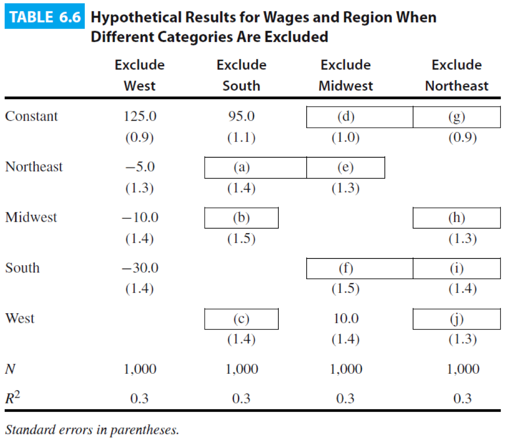

```{r dataPackages, echo=FALSE,message=FALSE,warning=FALSE}
library(foreign)
library(stargazer)
library(ggplot2)
data1 <- read.dta("data/childrenData.dta")
data2 <-  read.csv("data/olympics_HW.csv")
options(digits=4)

```


## What are Dummy Variables?

- Dummy variables are used to denote the presence of a condition or membership in a group

- Dummy variables are like light switches

- They are either "off" or "on"

- Dummy variable take on the values 0 and 1

- $0 = off \text{      } 1 = on$

##Testing Difference of Means

- We can use what we know about OLS models to get the most from dummy variables

- $Y_i = \beta_0 + \beta_{1}Dummy_i + \epsilon_i$

- What does a one unit change in the IV look like?

- When dummy = 0, prediction for $\hat{Y_i}$ is just $\beta_0$

- When dummy = 1, prediction for $\hat{Y_i}$ is  $\beta_0 + \beta_1$

##Testing Difference of Means

\includegraphics[width=0.5\textwidth, height=0.8\textheight]{images/obamaGraphic.png}
\includegraphics[width=0.45\textwidth, height=0.6\textheight]{images/obamaTable.png}

##An Example

How did sponsorship by Compassion International change outcomes for children in Uganda, Guatemala, the Philippines, India, Kenya, and Bolivia? (Wydick, Glewwe, and Rutledge 2013)

```{r model1, comment=NA}
m1 <- lm(totyrsedu ~ csp, data=data1)
coefficients(summary(m1))
```

##An Example

```{r model2, comment=NA}
m1 <- lm(totyrsedu ~ csp, data=data1)
coefficients(summary(m1))
m2 <- lm(totyrsedu ~ csp, data=data1[data1$treatedhh==1,])
coefficients(summary(m2))
```

##An Example

```{r newVars, echo=FALSE}
data1$male <- as.numeric(data1$sex==1)
data1$country <- as.factor(data1$country)
```

```{r newModel, comment=NA}
m3 <- lm(totyrsedu ~ csp + male + country, data=data1)
coefficients(summary(m3))
```

##Categorical Variables

- We often have variables that take on non-ordered categories

- One solution is to convert these to a series of dummy variables

- Interpretation is always with respect to excluded category

## An Exercise



## An Exercise



## An Exercise



## An Exercise



## Conditional Effects

- When the effect of X on Y depends on Z

- More education -> more income

- Effect might differ by gender

- Different intercept, different slope

## Estimating a Model with Interactions

Do host countries win more Olympic medals?

```{r comment=NA}
m1 <- lm(gold ~ host, data=data2)
coefficients(summary(m1))
```

## Estimating a Model with Interactions

Do richer countries win more Olympic medals?

```{r comment=NA}
m2 <- lm(gold ~ GDP, data=data2)
coefficients(summary(m2))
```

## Estimating a Model with Interactions

Is the effect of GDP different for host countries?

```{r comment=NA}
m3 <- lm(gold ~ GDP * host, data=data2)
coefficients(summary(m3))
```

## Host Countries

$$
\hat{Y_{host}}  =  0.25 + 4.38(Host) + 0.29(GDP) + 0.74(Host)(GDP)
$$
$$
\hat{Y_{host}} =  0.25 + 4.38(1) + 0.29(GDP) + 0.74(1)(GDP)
$$
$$
\hat{Y_{host}} =  4.63 + 1.03(GDP)
$$


## Non Host Countries

$$
\hat{Y_{nonHost}}   =  0.25 + 4.38(Host) + 0.29(GDP) + 0.74(Host)(GDP)
$$


$$ 
\hat{Y_{nonHost}} =  0.25 + 4.38(0) + 0.29(GDP) + 0.74(0)(GDP)
$$

$$
\hat{Y_{nonHost}}   =  0.25 + 0.29(GDP)
$$

## A Picture

```{r echo=FALSE,message=FALSE,warning=FALSE}
ggplot(data2, aes(GDP,gold)) + geom_point() + geom_smooth(method="lm")
```

## A Picture

```{r echo=FALSE, message=FALSE}
library(sjPlot)
plot_model(m3, type="int")
```

## The End {.c}
\centering
What questions do you have?


