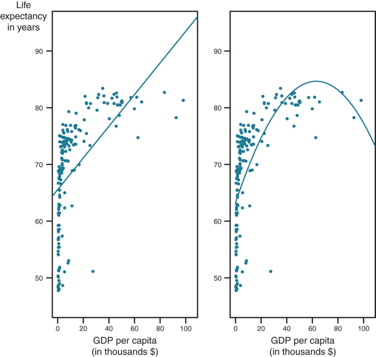

## Limitations of Linear Models

- We have dealt with _linear_ models

- Straight lines don't always capture relationship well

- Relationship between happiness and age

- How do we model non-linear relationships??

## Limitations of Linear Models

## OLS is Flexible

- We can include transformed versions of independent variables in the model

- This will allow us to produce curved lines as models

- Identical estimation procedure

- Interpretation can get a little tricky

## Non Linear Transformations

- **Polynomial Models** include values of an independent variable raised to power greater than one

- Simplest polynomial model is the quadratic model

- **Quadradic Models** include both $X$ and $X^2$ as variables.

## Interpreting Effects fo Quadradic Models

For a standard linear model... $Y_i = \beta_0 + \beta_1X_{1i} + \epsilon_i$
$$
\frac{\partial Y}{\partial X_1} = \beta_1
$$

## Interpreting Effects fo Quadradic Models

For a standard linear model... $Y_i = \beta_0 + \beta_1X_{1i} + \epsilon_i$
$$
\frac{\partial Y}{\partial X_1} = \beta_1
$$
For a quadratic model...$Y_i = \beta_0 + \beta_1X_{1i} + \beta_2X^2_{1i} + \epsilon_i$
$$
\frac{\partial Y}{\partial X_1} = \beta_1 + 2\beta_2X
$$

## Quadratic Models

- Because of the math, we don't need to know the shape of the effect ahead of time

- Data will dictate direction of model curve

## Log Transformations

- Logarithm of a number is the exponent to which we would have to raise a base to get that number.

- log(100) = 2 assuming base 10

- Natural log uses $e$ as a base.  $e$ = 2.71828

- ln(7.38) = 2 assuming base $e$

## Log Transformations

- Polynomial models are flexible

- Log transformations are good for relationships that rise or fall rapidly and then level off

- Mathematics allows us to interpret effects in terms of percentages

- Can transform either DV, IV, or both 

## Log-Linear Models

- **log-linear models** include a natural log transformation of the DV

- Effects of IV are in terms of percentages

- $ln(Wages) = \beta_0 + \beta_1Inflation + \epsilon$

- A one unit increase in Inflation is associated with a $\beta_1$ percent increase in Wages.

## Linear-Log Models

- **linear-log models** include a natural log transformation of the IV

- $Life Expectancy = \beta_0 + \beta_1ln(GDP) + \epsilon$

- A one percent increase in GDP is associated with a $\beta_1$ increase in Life Expectancy

## Log-Log Models

- **log-log models** include a natural log transformation of both the DV and IV

- $ln(Ticket Sales) = \beta_0 + \beta_1ln(Price) + \epsilon$

- Used often in economics to model elasticity 

- A one percent increase in Price is associated with a $\beta_1$ percent increase in Sales.

## Standardized Coefficients

- Regression coefficients give us effect of one unit change in IV on DV

- Most often, units of IVs are different

- One unit change in $X_1$ is not the same as a one unit change in $X_2$

- Coefficients are not directly comparable

## Standardized Coefficients

- Simple solution is to put variables on the same scale

- How many standard deviations away from the mean?

- `data$varStnd <- (data$var - mean(data$var))/sd(data$var)`

- or...`scale()` function

- `lm(scale(varD) ~ scale(var1) + scale(var2), data=data)`

## The End {.c}
\centering
What questions do you have?

