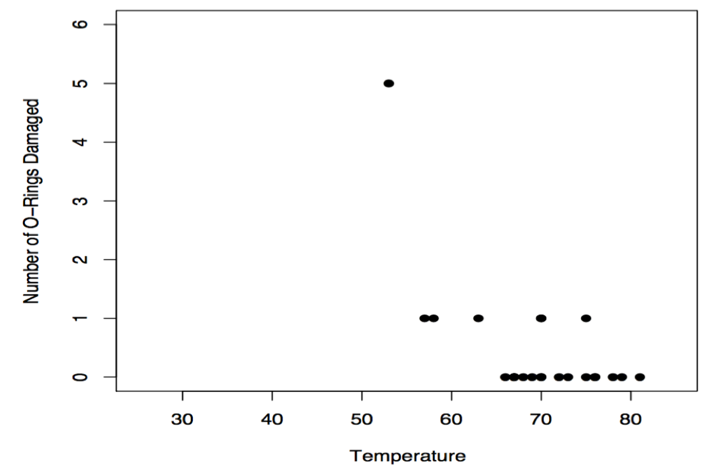
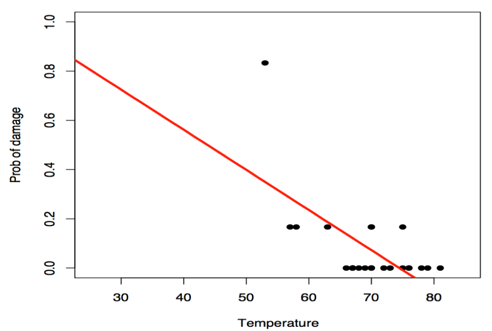
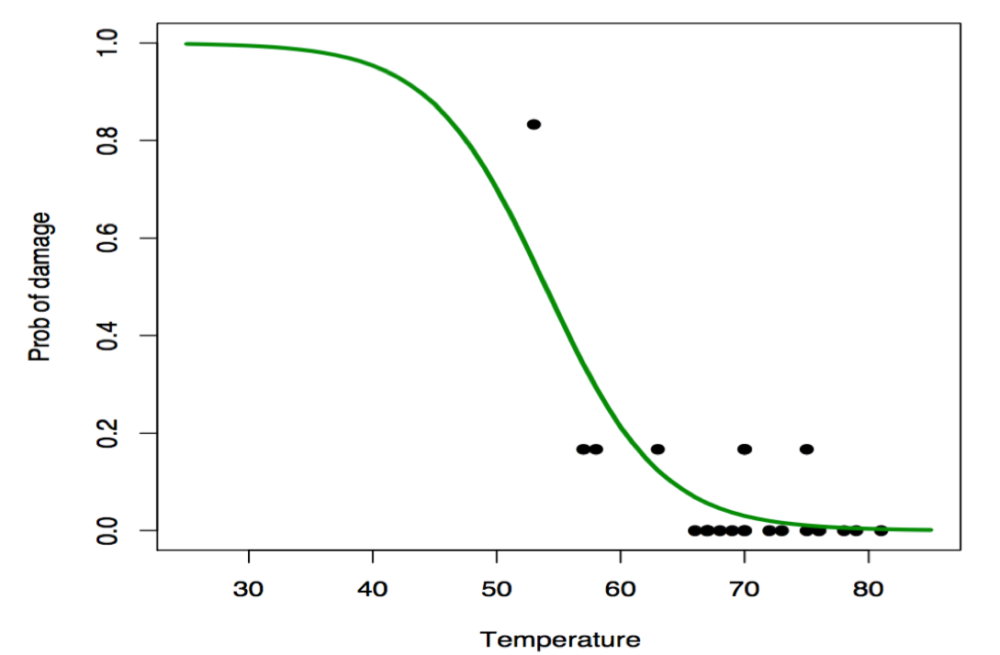
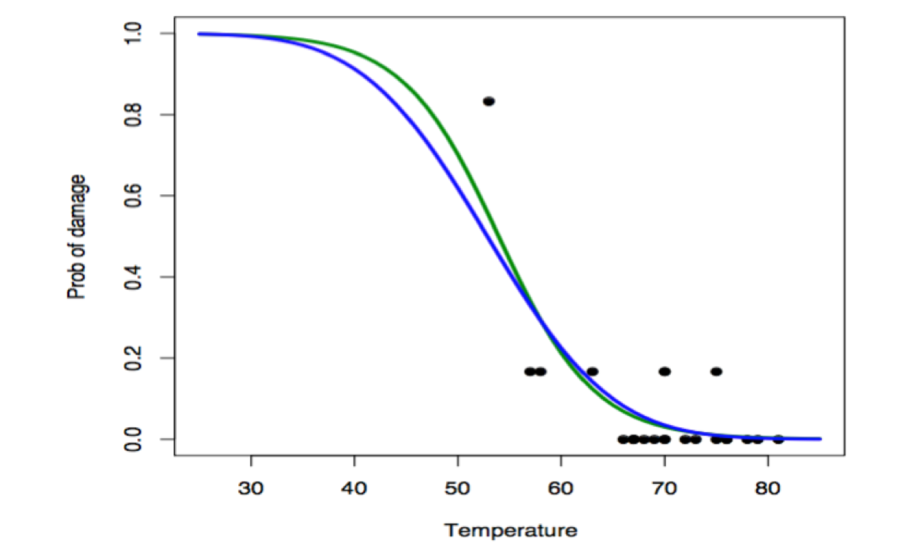
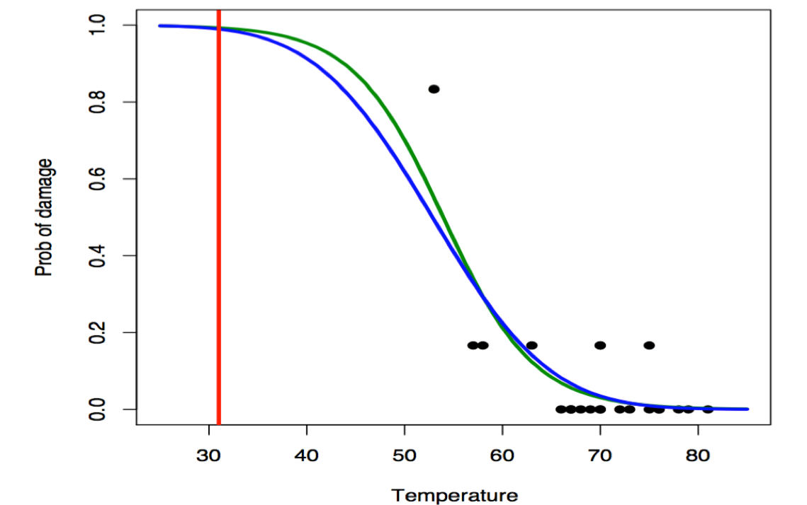
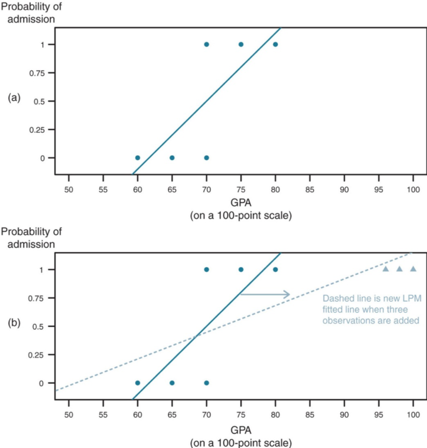
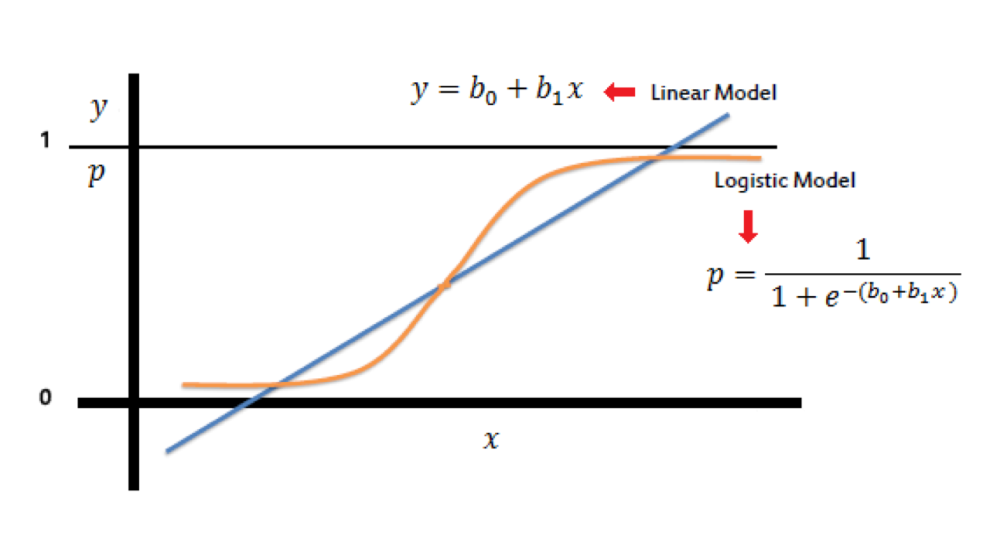
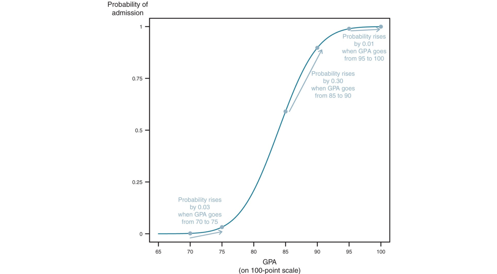

## The Space Shuttle Challenger, 1986


## The Space Shuttle Challenger, 1986


## The Space Shuttle Challenger, 1986

- January 28, 1986: space shuttle Challenger explodes 73 seconds after liftoff. 

- All seven astronauts on board are killed. Investigation focuses on O-ring seals in the rocket boosters. 

- At low temperatures, rubber gets brittle and less effective as a sealant. 

- The launch was on a cold day (31 F.). 

- Could the disaster have been predicted? Prevented??? 

## The Space Shuttle Challenger, 1986

- NASA had data on O-ring damage and launch temperature from the 23 previous launches. 

- 6 O-rings per shuttle (three rings on two boosters)

- How better statistics could have saved 7 lives: 
    - Estimate probability of failure given temperature at launch was 31 F 

##




## 


## 



## 




## 



## 



##



## Why Not Linear Models?

- Binary data not normally distributed, which is a condition to run OLS

- Predicted values of the dependent variable can go beyond 0 and 1
    - Violates definition of probability

- The relationship between variables is not linear
    - curvilinear

## Why Not Linear Models?



## Conditional Effects



## "Divide by Four" Rule

- The logistic curve is steepest at its center

- Thus $\beta/4$ is the maximum difference in Pr(y = 1) corresponding to a unit difference in x 

- Take logistic coefficients and divide by 4 to get an upper bound of the predictive difference corresponding to a unit difference in x 

- The upper bound is a reasonable approximation near the midpoint of the logistic curve, where probabilities are close to 0.5

## Implementing in R

````{r eval=FALSE, comment=NA}
model <- glm(y~ x1+ x2+ x3, data = mydata, 
             family = binomial(link=“logit”))
```

- As with linear regression, a coefficient is considered statistically significant if it is at least 2 standard errors from 0


## The End {.c}
\centering
What questions do you have?


