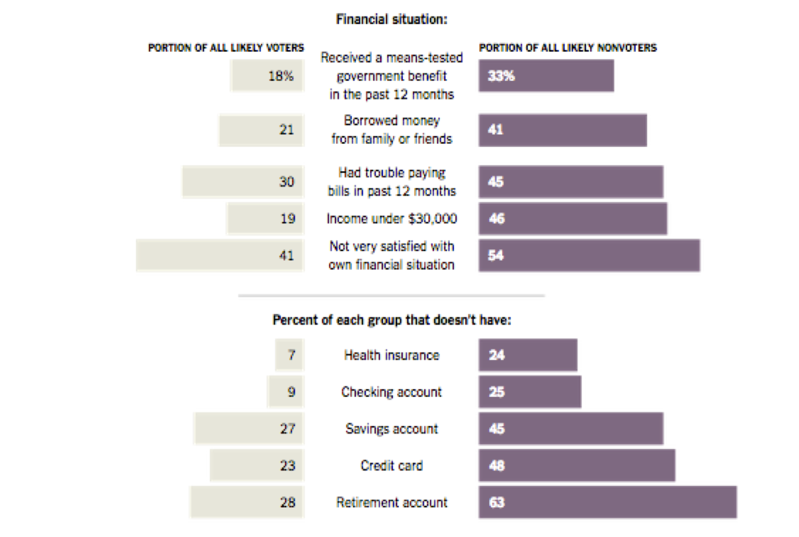

## It's a Process
 
 1. Question
 2. Literature Review
 3. Theory/Hypotheses
 4. Data
 5. Analysis
 6. Conclusions

## Where Do We Start?

 1. \textcolor{red}{Question}
 2. Literature Review
 3. Theory/Hypotheses
 4. Data
 5. Analysis
 6. Conclusions

## Topic v. Question
\begin{columns}
\column{.5\textwidth}
\textbf{Topics}
\small{\begin{itemize}
\item International development
\item Voting rights in U.S. Elections
\item Water disputes in the Middle East
\item Democratization
\item European elections
\end{itemize}}

\column{.5\textwidth}
\textbf{Questions}
\small{\begin{itemize}
\item Sentences with a ? at the end.
\end{itemize}}
\end{columns}

## {.c}

\centering
Good research questions are short and direct statements about an interesting, important, and answerable question.

## A Puzzle

Who Turned My \textcolor{blue}{Blue} State \textcolor{red}{Red}?
  
    
Why do states with higher concentrations of poor residents tend to support the party that is typically looking to cut social programs for the poor?

## {.c}

## Developing a Question
### Interests

  - Why major in political science?
  - What do you do for enrichment?
  - What interests you about these things?
  - What about courses or parts of courses?

## Developing a Question
### Importance

  - Who is your audience?
  - What have other people identified as important?
  - Is there a puzzle?
  - \textbf{why, how, to what extent, under what conditions}

## Developing a Question
### Brevity and Concision

 - Short and to the point 
 - Avoid extensive background

## Examples

\textcolor{red}{Bad}  
What percentage of registered voters voted in the most recent local elections?
  
\textcolor{green}{Good}  
Why is voter turnout for local elections higher in some cities than others?
  
\textcolor{red}{Bad}  
How much money does each school district in North Carolina spend?
  
\textcolor{green}{Good}  
Why does the amount spent per pupil by school districts in North Carolina vary?

## Examples

\textcolor{red}{Bad}  
How do U.S. Supreme Court justices make decisions?
  
\textcolor{green}{Good}  
To what extent does personal ideology impact justices' decisions?
  
\textcolor{red}{Bad}  
\small{Committees are an important part of the U.S. Congress.  Many researchers have noted that institutions like committees can have important impacts on legislative outcomes.  Also, Congress controls all government spending in the United States.  How then do committees impact spending?}
  
\textcolor{green}{Good}  
How does seniority and the committee structure impact roll-call voting on social spending bills?

## The End {.c}
\centering
What are your questions?

