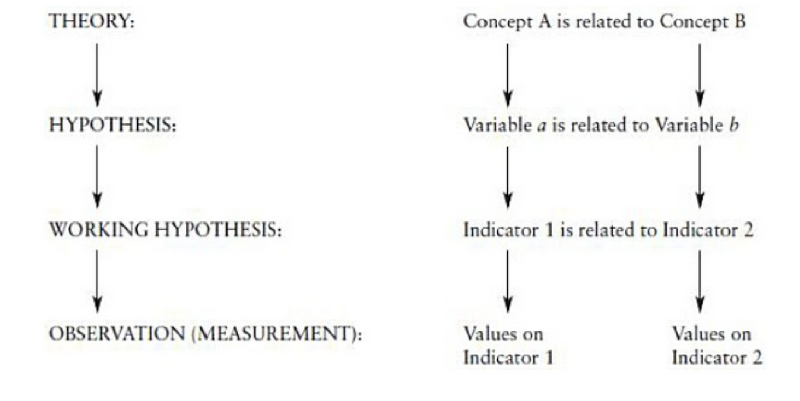
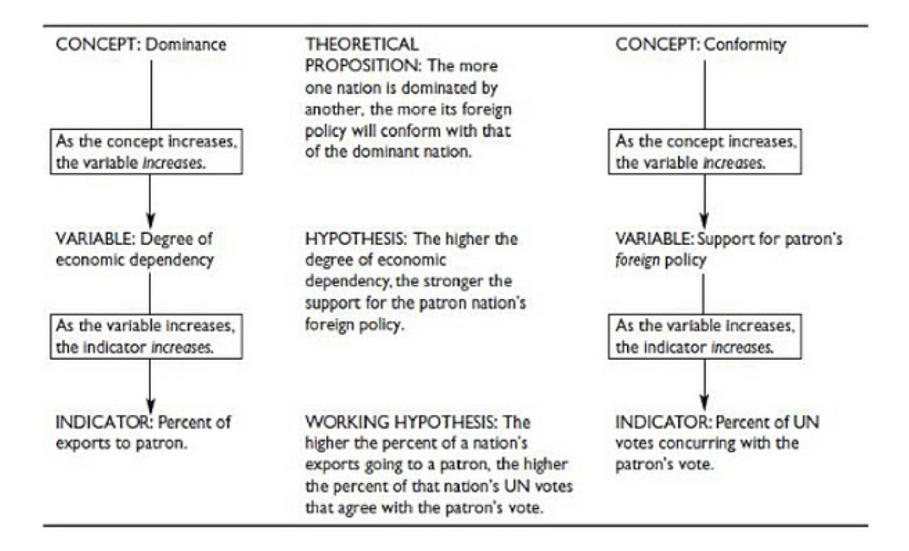

## It's a Process
 
 1. Question
 2. Literature Review
 3. Theory/Hypotheses
 4. Data
 5. Analysis
 6. Conclusions

## Where Are We Today?

 1. Question
 2. Literature Review
 3. \textcolor{red}{Theory/Hypotheses}
 4. Data
 5. Analysis
 6. Conclusions

## {.c}

"One of the first challenges in research is to devise ways of getting from the abstract level of our questions to some concrete observation that will allow us to answer them."

## Definition

Operationalization is the process of selecting observable phenomena to represent abstract concepts.

## Example

To what extent does the method of test-taking impact student performance?
  
What do we mean by "method of test-taking?"
  
What do we mean by "student performance?"

## Why Do We Operationalize?

  - One goal of our data analysis should always be generalizable inferences.
  - Start with abstract concepts in your theory.
  - Test theory with observable phenomena.
  - \textcolor{red}{Operationalization connects theory with observation}

## {.c}

## Operationalizing Complex Concepts

 - Many social science concepts are multidimensional
 - We can (and should) use multiple indicators to capture complex concepts
 - [The Fragile States Index](http://fundforpeace.org/fsi/indicators/)

## Levels of Measurement

### Nominal
 - Unordered categories
 - Limited information
 
### Ordinal
 - Ranked/ordered categories
 - More information than nominal
 - More meaningful comparisons
 
### Interval
 - Defined numerical unit of measure
 - Useful comparisons
 - Difference between observations is known and constant

## {.c}

## Assessing our Measures
### Reliability

 - Tells us how stable our measurements are.
 - Will we get the same results if we apply the same rules to the same cases?
 - Avoid systematic measurement error.
 
## Assessing our Measures
### Validity

 - Tells us the extent to which our measures correspond to the concepts they are intended to reflect.
 - Valid measures are _appropriate_ and _complete_.
 - Quality of public education across cities: number of teachers, ratio of teachers to students, facilities.
 
## Types of Validity
### Internal Validity

 - Are we measuring what we think we are measuring.
 - Face Validity: does it pass the "smell test?"
 - Content Validity: does it include all necessary elements?
 
### External Validity

 - How generalizable are our results?

## The End {.c}
\centering
What questions do you have?

