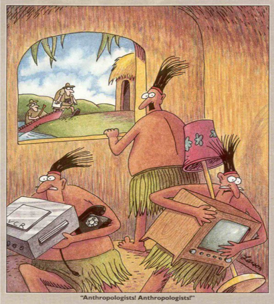

## It's a Process
 
 1. Question
 2. Literature Review
 3. Theory/Hypotheses
 4. Data
 5. Analysis
 6. Conclusions

## Where Are We Today?

 1. Question
 2. Literature Review
 3. Theory/Hypotheses
 4. \textcolor{red}{Data}
 5. Analysis
 6. Conclusions

## Methods of Gathering Data

- Participant observation (beware the "Hawthorne effect")
- Interviews
   - degree of structure will vary
   - the "art" of interviewing

## {.c}

## Methods of Gathering Data

- Participant observation (beware the "Hawthorne effect")
- Interviews
   - degree of structure will vary
   - the "art" of interviewing
   
## Advantages and Disadvantages
### Pros:
   - "thick data"
   - context, nuance, texture
   - new insights
   - stories, local narratives

### Cons:
  - lower confidence in findings
  - selection bias

## Rendering Qualitative Data into Quantitative

- How? Techniques
- Does it clarify, or distort?
- Coding questions

## Focus Group Interviews

- Usuaully 5-8 people
- Similar backgrounds
- Multiple groups; select by categories
- Moderator/Interviewer
- Semi-structured
- Group dynamics

## Focus Group Interviews
### Pros:
   - cost effective
   - brainstorming
   - can give voice to distinct groups
  
### Cons:
   - groupthink
   - dominant voices
   - honesty
   - "minders"

## General Interview Techniques

 - Relaxed atmosphere; trust is key
 - Explain your work clearly (honestly)
 - Early questions can have an outsized influen
 - Elicit stories, not just generalizations
 
## General Interview Techniques

 - Speaking after hours
 - Recording v. recalling interviews
 - Private space - car rides, etc.
 - Gender or cultural issues
 
## Human Subjects

 - Ethical responsibilities of researchers
 - Do no harm
 - Institutional Review Board

## The End {.c}
\centering
What questions do you have?

