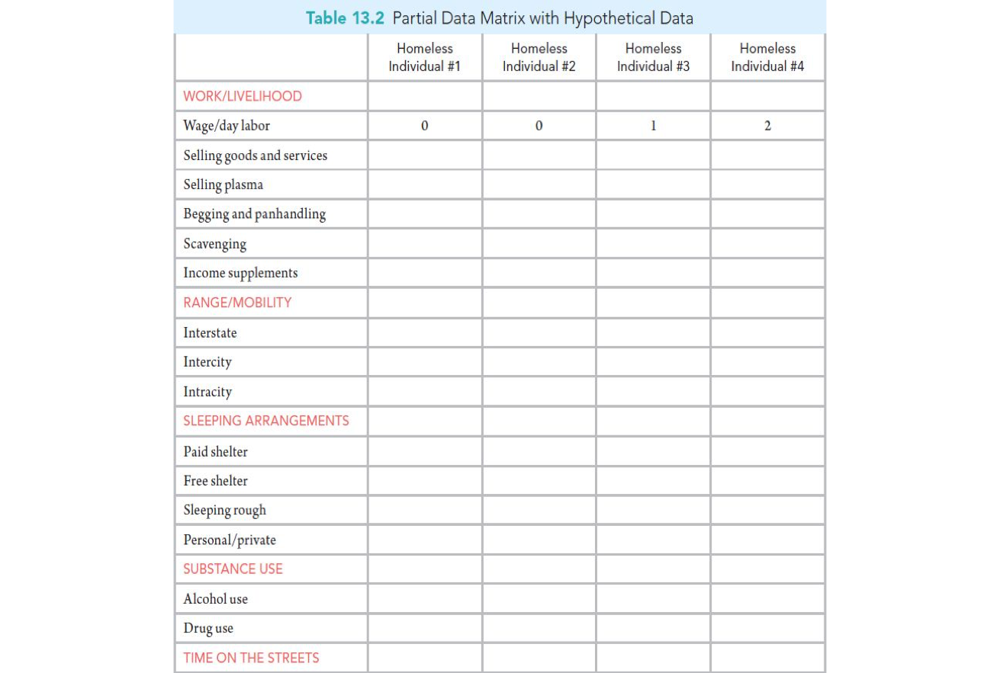
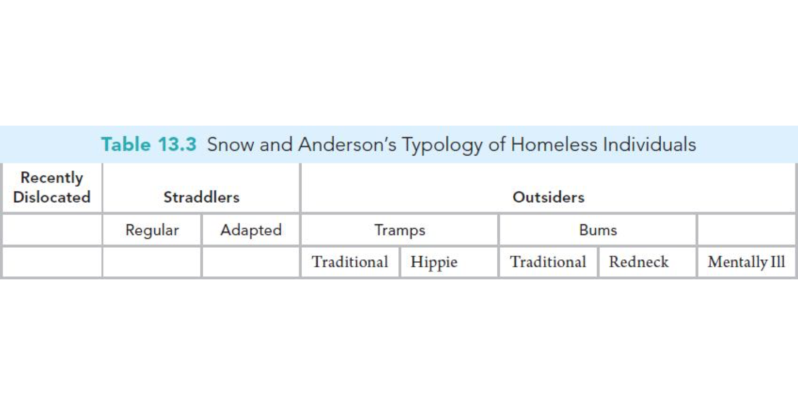

## It's a Process
 
 1. Question
 2. Literature Review
 3. Theory/Hypotheses
 4. Data
 5. Analysis
 6. Conclusions

## Where Are We Today?

 1. Question
 2. Literature Review
 3. Theory/Hypotheses
 4. Data
 5. \textcolor{red}{Analysis}
 6. Conclusions

## Process of Analyzing Qualitative Data {.c}

## Preparing Qualitative Data for Analysis

- Transform the data
- Check for errors
- Manage the data

## Transcription Errors

## Coding

 - Unit of analysis
 - Inter-coder reliability
 - Ask questions
 - Categories variable and flexible

## Memo Writing

- Personal reflections on experiences, issues, patterns
- Used in conjunction with coding
- Code book/Research log

## Displaying Data

- \textbf{Taxonomy}: system of ordered classification  
  
- \textbf{Data Matrix}: individuals or other units represent columns and coding categories represent rows  
  
- \textbf{Typology}: representation of findings based on the interrelationship between two or more ideas, concepts, or variables  
  
- \textbf{Flow Chart}: diagrams that display processes

## Data Matrix

## Typology

 
## Flow Chart

 
## Drawing and Evaluating Conclusions
### Conclusions
- Descriptive $\leftrightarrow$ Theoretical

### Evaluations
- Compare notes
- Exceptions
- Member checking

## Grounded Theory

 - Develop theory from data
 - Emphasis on actions and voice
 - Constant-comparative method
 - Memo-writing

## Narrative Analysis

 - Examine the structure and meaning of stories
 - Used to examine literary work and interviews
 - Life history or life experience
 
## Conversation Analysis

- Examine structure, sequencing, and word choice
- Video or audio recordings
- Detail in note-taking or transcription; pauses, emphases, silence

## The End {.c}
\centering
What questions do you have?

