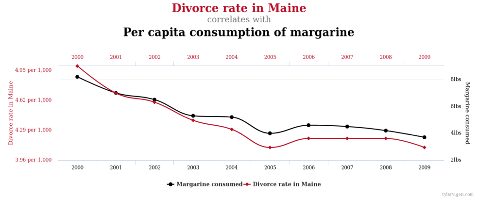
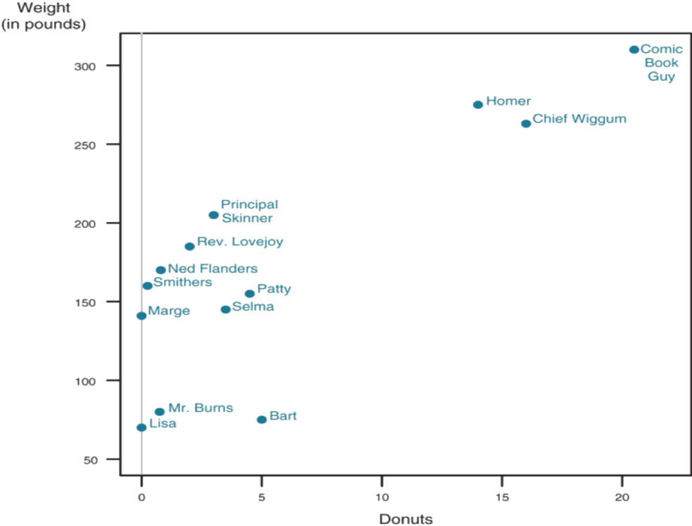
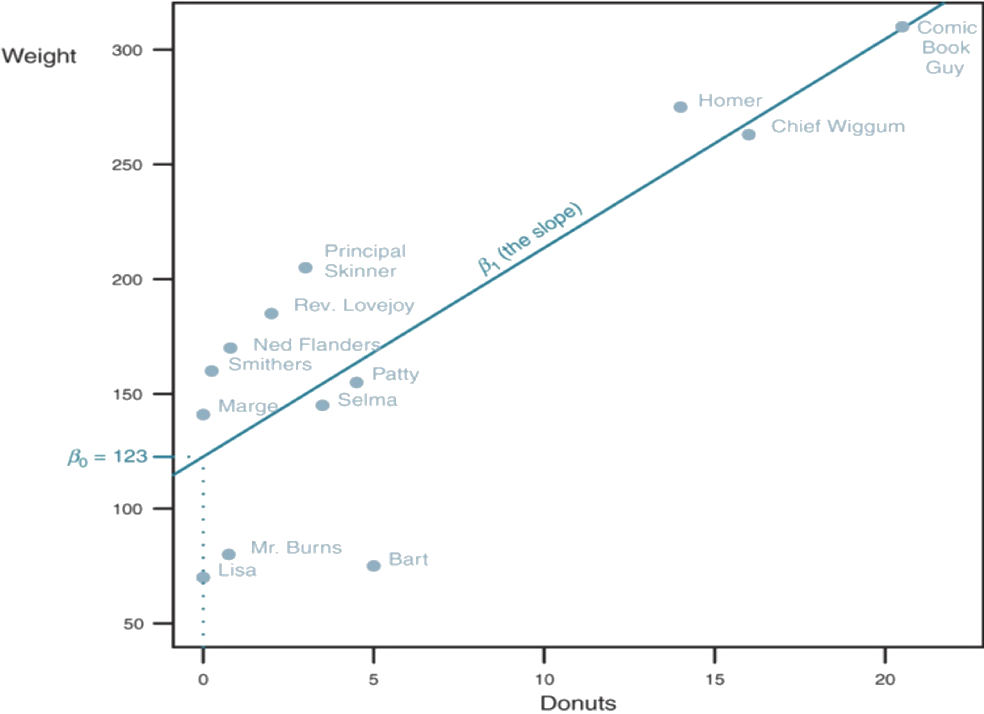

##  {.c}
\begin{center}
\LARGE{correlation $\neq$ causation}
\end{center}
 
## Spurious Correlations {.c}

## Donuts in Springfield

## Donuts in Springfield

## Donuts in Springfield {.c}

\begincols
  \begincol{.5\textwidth}

  \endcol
\begincol{.50\textwidth}

$Weight_i = \beta_0 + \beta_{1}Donuts_i + \epsilon_i$

  \endcol
\endcols

## The Equation

$\textcolor{red}{Weight_{i}} = \beta_{0} + \beta_{1}Donuts_{i} + \epsilon_{i}$

 - The value of observation $i$ for our dependent variable (Y)
 - The weight of person $i$
 
## The Equation

$Weight_{i} = \beta_{0} + \beta_{1}\textcolor{red}{Donuts_{i}} + \epsilon_{i}$

 - The value of observation $i$ for our independent variable (X)
 - The number of donuts eaten per week by person $i$

## The Equation

$Weight_{i} = \textcolor{red}{\beta_{0}} + \beta_{1}Donuts_{i} + \epsilon_{i}$

 - The intercept: the expected value of the dependent variable (Y) when the independent variable (X) is 0.
 - The expected weight of people who eat zero donuts per week.

## The Equation

$Weight_{i} = \beta_{0} + \textcolor{red}{\beta_{1}}Donuts_{i} + \epsilon_{i}$

 - The slope coefficient: the change we will see in Y after a 1 unit change in X.
 - How much more will a person weigh for each additional donut eaten per week?

## The Equation

$Weight_{i} = \beta_{0} + \beta_{1}Donuts_{i} + \textcolor{red}{\epsilon_{i}}$

 - Error term: all of the unmeasured values in our model
 - All the things that impact the weight of person $i$ other than donuts

## Endogeneity

 - Correlation between independent variable(s) and the error term.
 - Makes it difficult to discern what is affecting Y.
 - Can bias our conclusions about the effect of X on Y.
 
## Endogeneity

 - With endogeneity, correlation can never mean causation
 - With exogeneity, correlation is much more likely to mean causation.
 
## Randomness

 - One solution to the endogeneity problem
 - Randomized experiments are the gold standard
 - Often unattainable in political or social science research.

## The End {.c}
\centering
What questions do you have?

