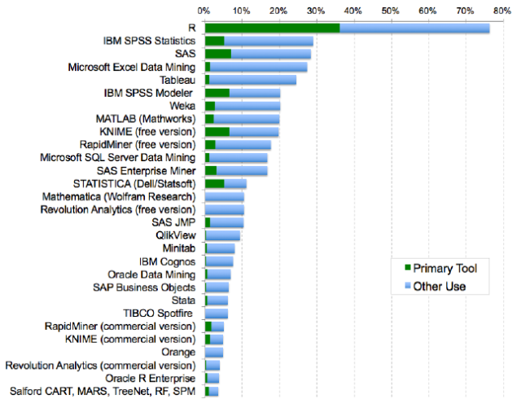
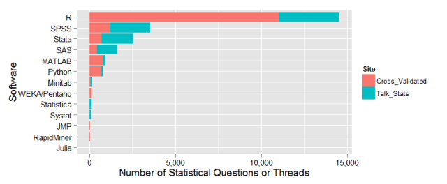
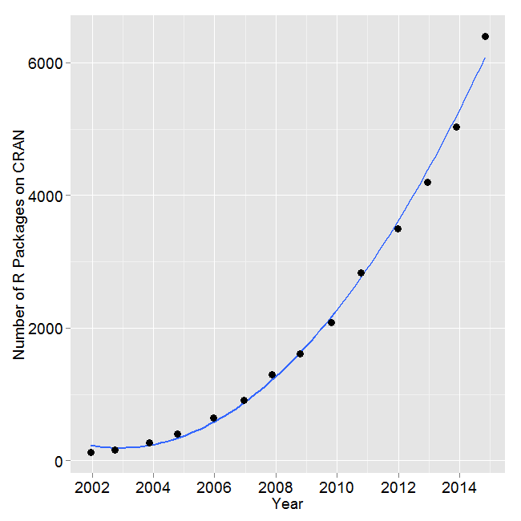

## What is R?

 - R is an open source software written for statistical computation and graphics
 - Initially developed in 1993
 - Based on the S programming language

## Why R?

 - Free
 - Open source
 - Very popular
 - State-of-the-art
 - Extremely flexible
 - Graphics!
 
## How Popular?



## How Popular?



## How Popular?


 
## Terminology

 - Assignment: `x <- 2`
    - `<-` is assignment operator: read as "gets"
 - Functions: `mean(x)`
    - arguments to functions (options) go inside parentheses
 - Comments: `#this is a comment`
    - R will ignore anything after the `#` symbol
    - Use LOTS of comments

## Terminology

 - Objects
    - Analysis in R is done in steps
    - Intermediate results are stored as objects
    - We can call upon these later in our analyses
    - Common types:
        - **scalar**: a single number
        - **vector**: a row or column of data; a single dimensional array
        - **data frame**: a data set with many rows and columns

## Getting Help

 - In R Studio
    - Help tab in lower right pane
    - Search by function or package name
 - In R console
    - `help(mean)`
    - `??mean`
 - Other Resources
    - R Seek: <http://rseek.org/>
    - Stack Overflow: <https://stackoverflow.com/>
    - Lots of others!
    
## Common Issues

 - R is a programming language; must be precise
 - Error messages are not helpful
 - Rules not always consistent
 - Multiple paths to success 

## R is CasE SenSitive

 - Help(mean)
 - help(Mean)
 - help(mean)  
   
 - These are not the same...only one will work!
 
## Quick Tricks

 - R will print a `+` if you give it an incomplete command
 - Example: `3*(2+2`
 - Anything else you type will be considered a continuation
 - If you see the `+` just press `ESC` and start over
 
## Quick Tricks

 - Watch out for "smart quotes" 
 - Commonly produced by Word, PowerPoint, etc.
 - R does not understand
 
## Functions in R: Basic Syntax

 - R has many built-in functions
 - To call a function just type the name followed by parentheses
    - `sqrt()`  
    - `mean()`
 - Arguments
    - `functionName(object, option)`
    - `sqrt(x)`
    - `mean(x, na.rm=TRUE)`
    
## Data in R

```{r dataFrame, comment=NA}
name <- c("Larry", "Moe", "Curly", "Shemp")
height <- c(65,67,69,62)
bald <- c(0,0,1,0)
data <- data.frame(name, height, bald)
data
```

## Data in R

Ask R to print values of a variable from a data frame
```{r dataFrame2, comment=NA}
data$height
```
Ask R to calculate the average of a variable
```{r dataFrame3, comment=NA}
mean(data$height)
```

## First Steps

 - Always check your data!
 - Use `head()` AND `summary()` commands in R
 - Check variables
 - Check values
 
## Dealing with Data

 - Recoding
 - Reshaping
 - Check out `dplyr` and Tidy Data

## The End {.c}
\centering
What questions do you have?


