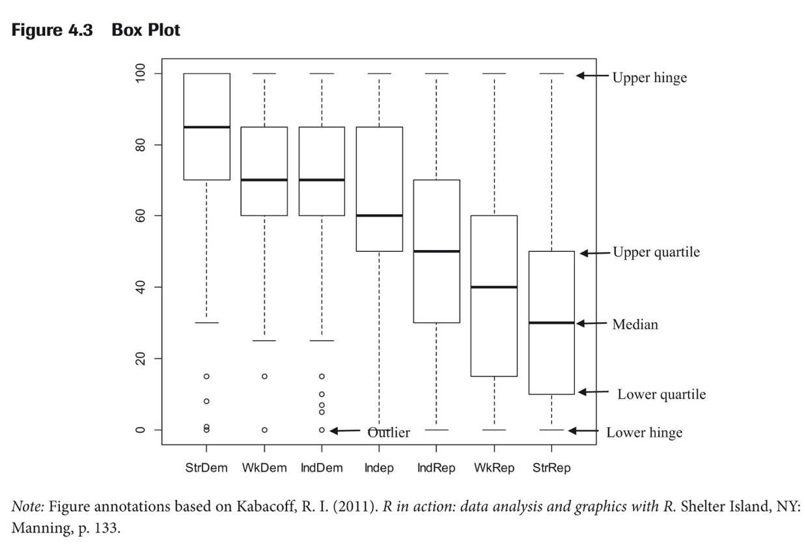

```{r setup, include=FALSE}
knitr::opts_chunk$set(dev = 'pdf')
```

```{r eval=TRUE, echo=FALSE, warning=FALSE, message=FALSE, comment=NA}
library(ggplot2)
library(psych)
library(ggthemes)
```

## Why ggplot?

 - Base R has some fine graphics capabilities but they are limited and can be a bit clunky
 - `ggplot2` is a package that is much more flexible and much more capable
 - Can seem overwhelming but there is logic
 - The "gg" stands for "Grammar of Graphics"
 
## Getting Started

First, install the `ggplot2` package and make it active:
```{r eval=FALSE}
install.packages("ggplot2")
library(ggplot2)
```
We're also going to use an example data set from the `psych` package:
```{r eval=FALSE}
install.packages("psych")
library(psych)
```

## SAT data

There is a data set in the `psych` package called `sat.act`. Let's check that out.  
```{r eval=FALSE}
help(sat.act)
```
We can also take a look at the first few lines of the data:
```{r comment=NA}
head(sat.act, 5)
```

## Checking out the data

One useful tool is to check the structure of the data:
```{r comment=NA}
str(sat.act)
```
Gender should be a factor variable.  Let's fix that.
```{r comment=NA}
sat.act$gender <- as.factor(sat.act$gender)
```

## The Basic Grammar {.c}


```{r eval=FALSE}
ggplot(sat.act, aes(x=SATV, y=SATQ)) + geom_point()
```


## {.c}
```{r warning=FALSE, message=FALSE, comment=NA}
ggplot(sat.act, aes(x=SATV, y=SATQ)) + geom_point()
```


## Aesthetics

- Aesthetics (our first term) – describe how the data is mapped to various aspects of a graph.
- Examples are things like color, size, shape, alpha (transparency).
- Simply add them as another argument.

## {.c}
```{r warning=FALSE, message=FALSE, comment=NA}
ggplot(sat.act, aes(x=SATV, y=SATQ, color=gender)) + 
  geom_point()
```

## {.c}
```{r warning=FALSE, message=FALSE, comment=NA}
ggplot(sat.act, aes(x=SATV, y=SATQ, shape=gender)) + 
  geom_point()
```

## Aesthetics

 - Aesthetics behave differently depending on whether the variable being mapped to them is discrete or continuous.

 - e.g., different colors (discrete) vs. shading gradients (continuous)

 - Let's see what happens when we color by a continuous variable - education

## {.c}
```{r warning=FALSE, message=FALSE, comment=NA}
ggplot(sat.act, aes(x=SATV, y=SATQ, color=education)) + 
  geom_point()
```

## Histograms
```{r warning=FALSE, message=FALSE, comment=NA}
ggplot(sat.act, aes(x=SATV)) + geom_histogram()
```

## Histograms
```{r warning=FALSE, message=FALSE, comment=NA}
ggplot(sat.act, aes(x=SATV)) + geom_histogram(binwidth = 50)
```

## Bar Graphs
```{r warning=FALSE, message=FALSE, comment=NA}
ggplot(sat.act, aes(gender)) + geom_bar()
```

## Geoms

 - Geoms (our next aesthetic term) – the geometric shape you want to map the data to.
 - You add it as an argument like the other aesthetics.
```{r eval=FALSE}
ggplot(sat.act, aes(SATV, SATQ)) + geom_point()
```
 - We use `geom_point` in our example.
 - Another usefule geom is `smooth`:
 
## Geoms
```{r warning=FALSE, message=FALSE, comment=NA}
ggplot(sat.act, aes(SATV, SATQ)) + geom_smooth()
``` 
 
## Combining Geoms
```{r warning=FALSE, message=FALSE, comment=NA}
ggplot(sat.act, aes(SATV, SATQ)) + geom_point() + 
  geom_smooth()
``` 

## Regression Line
```{r warning=FALSE, message=FALSE, comment=NA}
ggplot(sat.act, aes(SATV, SATQ)) + geom_point() + 
  geom_smooth(method = "lm")
``` 

## Regression Line
```{r warning=FALSE, message=FALSE, comment=NA}
ggplot(sat.act, aes(SATV, SATQ)) + geom_point() + 
  geom_smooth(method = "lm", se = FALSE)
``` 

## Discrete X Continous Y
```{r warning=FALSE, message=FALSE, comment=NA}
ggplot(sat.act, aes(gender, SATQ)) + geom_point()
``` 
 
## Discrete X Continous Y
```{r warning=FALSE, message=FALSE, comment=NA}
ggplot(sat.act, aes(gender, SATQ)) + geom_point() +
  geom_jitter()
``` 

## Boxplots
```{r warning=FALSE, message=FALSE, comment=NA}
ggplot(sat.act, aes(gender, SATQ)) + geom_boxplot()
```

## Box and Whisker Plots



## Themes

```{r eval=FALSE, message=FALSE, warning=FALSE}
library(ggthemes)
```
```{r eval=FALSE, message=FALSE, warning=FALSE}
ggplot(economics, aes(date, uempmed)) + 
  geom_line(color="red") +  
	labs(list(x="Year", y="", 
	title="Unemployment in the United States", 
	subtitle="Median Number of Weeks")) + 
  scale_y_continuous(position = "right") +
  theme_economist()
```

## Themes
```{r echo=FALSE, message=FALSE, warning=FALSE}
ggplot(economics, aes(date, uempmed)) + geom_line(color="red") +  
	labs(list(x="Year", y="", title="Unemployment in the United States", 
	subtitle="Median Number of Weeks")) + scale_y_continuous(position = "right") +
  theme_economist()
```

## The End {.c}
\centering
What questions do you have?


